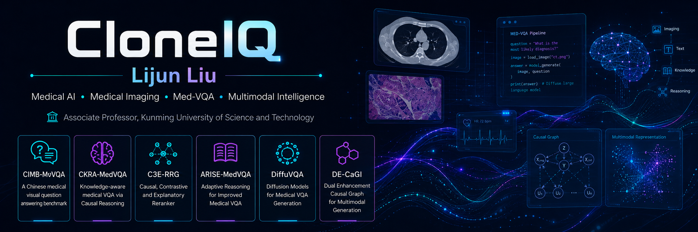

  

  
  
  

  <b>AI for Medical Imaging · Medical Visual Question Answering · Radiology Report Generation · Trustworthy Multimodal Medical Intelligence</b>

## 👋 About

I am **Lijun Liu** (`@cloneiq`), working on **medical artificial intelligence**, with a focus on medical imaging, multimodal learning, medical visual question answering, radiology report generation, and trustworthy clinical reasoning.

My GitHub is organized as a research-oriented project hub for reproducible medical AI, including model implementations, academic resource repositories, and medical image analysis projects.

## 🔬 Research Focus

<table>
  <tr>
    <td width="33%">
      <b>Medical Visual Question Answering</b> 
      Med-VQA, knowledge-enhanced reasoning, causal debiasing, evidence grounding, and active inquiry.
    </td>
    <td width="33%">
      <b>Radiology Report Generation</b> 
      Chest X-ray report generation, causal evidence coupling, semantic consistency, and clinical evaluation.
    </td>
    <td width="33%">
      <b>Medical Image Analysis</b> 
      Polyp segmentation, lesion-aware modeling, boundary enhancement, and diagnosis-oriented image understanding.
    </td>
  </tr>
</table>

## ⭐ Featured Research Projects

| Project | Focus |
|---|---|
| [**ARISE-MedVQA**](https://github.com/cloneiq/ARISE-MedVQA) | A curated academic resource hub for Medical Visual Question Answering, covering surveys, datasets, metrics, methods, MLLMs, medical agents, and code resources. |
| [**CIMB-MVQA**](https://github.com/cloneiq/CIMB-MVQA) | Causal intervention on modality-specific biases for Medical Visual Question Answering. |
| [**CKRA-MedVQA**](https://github.com/cloneiq/CKRA-MedVQA) | Dynamic context-aware cross-modal contrastive learning for Medical Visual Question Answering. |
| [**DE-CaGI**](https://github.com/cloneiq/DE-CaGI) | Causal gradient intervention for debiased and evidence-grounded Medical Visual Question Answering. |
| [**C3E-RRG**](https://github.com/cloneiq/C3E-RRG) | Confounder-aware causal evidence coupling and evolution for chest X-ray report generation. |

## 🛠️ Technical Interests

  
  
  
  
  
  

## 📌 Pinned Repositories

**The following pinned repositories highlight representative work by our team in medical VQA, radiology report generation, and medical image analysis.**

